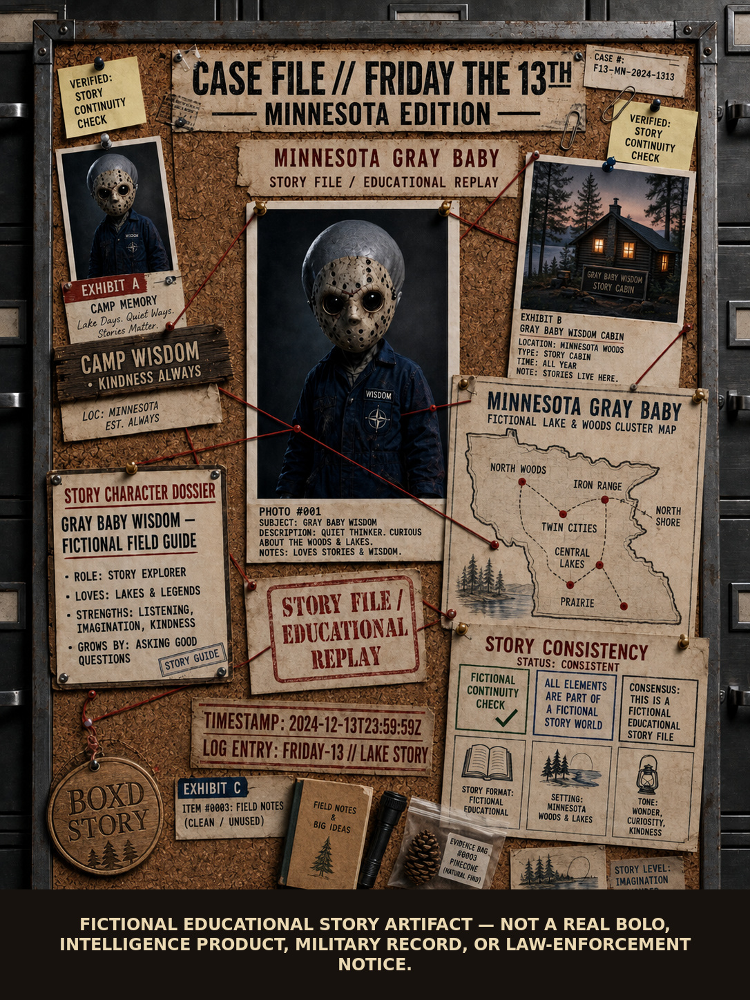

# Minnesota Gray Baby BOLOs — Fictional Story Package v0.1

> **FICTIONAL EDUCATIONAL STORY ARTIFACT — NOT A REAL BOLO, INTELLIGENCE PRODUCT, MILITARY RECORD, OR LAW-ENFORCEMENT NOTICE.**

This draft preserves the Minnesota Edition case-board image as a fictional educational story artifact.



## Minnesota Edition

- Setting: Minnesota woods and lakes, cabin, and North Shore framing.
- Map: Minnesota outline with fictional regional story nodes.
- Character framing: Story Character Dossier; no military personnel language.
- Exhibits: field notebook, flashlight, and pinecone; no weapon exhibit.
- Emblems: no NATO emblem, classification, clearance, or governmental seal.
- Disclaimer: permanently embedded in the JPEG.

## Evidence boundary

- The depicted character is not a real-person target.
- The image is not a law-enforcement BOLO or operational notice.
- Visible story labels are fictional design elements.
- SHA-256 identifies the supplied image bytes; it does not establish depicted claims.

## Artifact

```text
FILE         = MINNESOTA_GRAY_BABY_BOLO_001_MINNESOTA_EDITION.jpg
FORMAT       = JPEG
DIMENSIONS   = 1086 × 1448
SIZE         = 852702 bytes
SHA256       = f7f2da421a53671224cbd511284867d402c3188db4ef30cef0ffab85be3d8c69
MERGE        = NOT_AUTHORIZED
AUTHORITY    = NOT_CREATED
```
